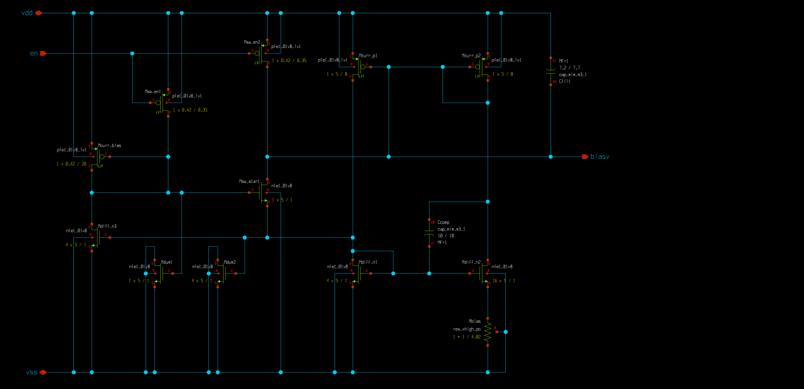
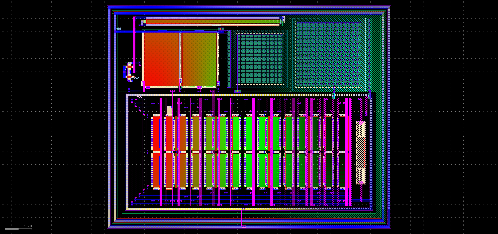

# bandgap_bmr

A beta-multiplier reference design used to bias the bandgap op-amps.

Using matched PMOS the output will nominally be  ( /  / ).

The layout is within the whole project layour GDS in `design/layout/amsat_txrs_ic.gds`.

More specs and test results to follow...

